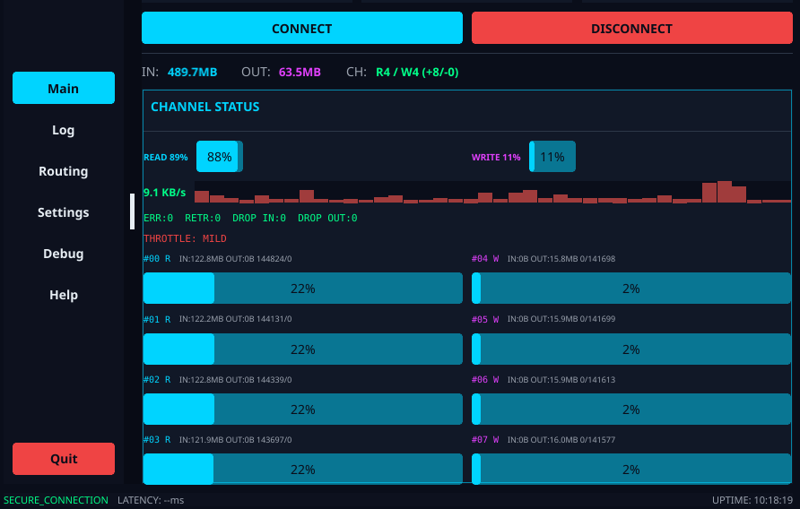

# SSH VPN

[](https://github.com/nnip7777/ssh-vpn/releases)
[](https://go.dev/)
[](LICENSE)
[](#platform-support)

Multi-channel VPN with load balancing and fault tolerance over SSH.



## Why SSH VPN?

Standard VPNs (WireGuard, OpenVPN) use a single connection. ISPs can identify and throttle VPN traffic by DPI. SSH VPN uses multiple SSH channels — a protocol that ISPs cannot block without disrupting developers, sysadmins, and businesses worldwide.

**Key advantages:**
- **ISP throttling resistance** — multiple parallel channels distribute traffic, reducing the impact of per-connection throttling
- **Undetectable** — standard SSH protocol, indistinguishable from normal SSH sessions
- **No exotic protocols** — SSH is used globally; blocking it is impractical for ISPs
- **Multi-channel load balancing** — weighted round-robin across read/write channels
- **Real-time monitoring** — GUI dashboard with throughput, per-channel stats, and throttle detection

## Architecture

```
┌─────────────────────────────────────────────────────────┐
│                    SSH VPN Architecture                  │
├─────────────────────────────────────────────────────────┤
│                                                          │
│  Client                                                  │
│  ┌─────────┐    ┌──────────────────────────────────┐   │
│  │   TUN   │◄──►│   Channel Manager (Read/Write)    │   │
│  └─────────┘    │   Weighted Round-Robin Balancer   │   │
│                 │   Auto-scaling + Fault Tolerance   │   │
│                 └───────────────┬──────────────────┘   │
│                                 │ SSH (AES-256-GCM)     │
│  Server                         │ × N channels          │
│  ┌──────────────────────────────▼──────────────────┐   │
│  │   SSH Server → Channel Manager → TUN Interface  │   │
│  │   Per-client routing + NAT + MSS clamping       │   │
│  └─────────────────────────────────────────────────┘   │
│                                                          │
└─────────────────────────────────────────────────────────┘
```

## Features

### Multi-Channel VPN
- Multiple SSH connections per client with independent channels
- Read channels (80%) and Write channels (20%) — configurable ratio
- Weighted round-robin load balancing across channels
- Dynamic channel scaling based on traffic patterns
- Automatic failover when channels become unhealthy

### ISP Throttling Resistance
- Parallel channels distribute traffic across multiple SSH connections
- Per-channel throughput monitoring with anomaly detection
- Throttle detection: throughput drops, error spikes, latency spikes
- Visual indicators in GUI (sparkline turns red during throttling)

### Real-Time Monitoring (GUI)
- Connection status dashboard with server/TUN info
- Throughput sparkline (MB/s) with per-bar throttling indicators
- Per-channel stats: bytes in/out, packets, errors, retransmits
- Error counters: ERR, RETR, DROP_IN, DROP_OUT
- Throttle level display: NONE / MILD / MODERATE / SEVERE
- Channel lifecycle tracking (+created/-closed)

### Event Logging
- Structured JSON logs with rotation (10MB/file, 7 files max)
- Server, client CLI, and GUI all write to log files
- Periodic stats dumps (every 30s): throughput, channels, errors
- Log levels: INFO, WARN, ERROR, DEBUG, OK
- Old logs auto-rotated by date

### Security
- AES-256-GCM encryption via SSH protocol
- LZ4 compression for bandwidth optimization
- Host key authentication
- Per-client isolation on server

### Cross-Platform
- Server: Linux (amd64, arm64)
- Client CLI: Linux, macOS, Windows
- Client GUI: Linux, macOS, Windows (Fyne v2, native look)
- Mobile: iOS (Swift), Android (Kotlin)

## Quick Start

### Server (Linux)

```bash
# Download
wget https://github.com/nnip7777/ssh-vpn/releases/download/v0.4.0/ssh-vpn-server-linux-amd64
chmod +x ssh-vpn-server-linux-amd64

# Generate host key
./ssh-vpn-server-linux-amd64 -generate-key

# Add authorized key
echo "ssh-ed25519 AAAA... user@host" > authorized_keys

# Start
sudo ./ssh-vpn-server-linux-amd64
```

### Client (CLI)

```bash
# Download
wget https://github.com/nnip7777/ssh-vpn/releases/download/v0.4.0/ssh-vpn-client-macos-amd64
chmod +x ssh-vpn-client-macos-amd64

# Configure
cat > client.yaml << 'EOF'
client:
  server_addr: "your-server.com"
  server_port: 2222
  username: "vpnuser"
  private_key_path: "~/.ssh/id_rsa"
  tun_name: "utun5"
  tun_addr: "10.8.0.2"
channels:
  min_read: 4
  max_read: 8
  min_write: 2
  max_write: 4
  read_ratio: 0.8
  write_ratio: 0.2
EOF

# Start
sudo ./ssh-vpn-client-macos-amd64 -config client.yaml
```

### Client (GUI)

```bash
# Download
wget https://github.com/nnip7777/ssh-vpn/releases/download/v0.4.0/ssh-vpn-gui-macos-amd64
chmod +x ssh-vpn-gui-macos-amd64

# Start
./ssh-vpn-gui-macos-amd64 -config client.yaml
```

## GUI Dashboard

The GUI client provides a cyberpunk-styled dashboard with:

| Tab | Features |
|-----|----------|
| **Main** | Connection status, server/TUN info, connect/disconnect, throughput sparkline, channel status |
| **Log** | Event log table with filtering, search, font size control, copy/save to file |
| **Routing** | Full/Per-App routing mode, application selection |
| **Settings** | Server, port, auth, TUN config, auto-connect |
| **Debug** | Network diagnostics, system info collection |

## Configuration

### Server Config

```yaml
server:
  listen_addr: "0.0.0.0"
  listen_port: 2222
  max_clients: 100
  tun_name: "ssh-vpn0"
  tun_addr: "10.8.0.1"
  tun_netmask: "255.255.255.0"
  mtu: 1280

channels:
  min_read: 2
  max_read: 8
  min_write: 1
  max_write: 4
  read_ratio: 0.8
  write_ratio: 0.2
  health_check: 5s
  timeout: 30s
```

### Client Config

```yaml
client:
  server_addr: "your-server.com"
  server_port: 2222
  username: "vpnuser"
  password: ""
  private_key_path: "~/.ssh/id_rsa"
  tun_name: "utun5"
  tun_addr: "10.8.0.2"
  tun_netmask: "255.255.255.0"
  mtu: 1280
  auto_connect: true

channels:
  min_read: 4
  max_read: 8
  min_write: 2
  max_write: 4
  read_ratio: 0.8
  write_ratio: 0.2
  health_check: 5s
  timeout: 30s

security:
  encryption: "aes256-gcm"
  compression: "lz4"
```

## Platform Support

| Platform | Architecture | Binary |
|----------|-------------|--------|
| Linux (server) | amd64, arm64 | `ssh-vpn-server-linux-*` |
| Linux (CLI) | amd64, arm64 | `ssh-vpn-client-linux-*` |
| macOS (CLI) | amd64, arm64 | `ssh-vpn-client-macos-*` |
| Windows (CLI) | amd64 | `ssh-vpn-client-windows-*.exe` |
| Linux (GUI) | amd64, arm64 | `ssh-vpn-gui-linux-*` |
| macOS (GUI) | amd64, arm64 | `ssh-vpn-gui-macos-*` |
| Windows (GUI) | amd64 | `ssh-vpn-gui-windows-*.exe` |
| iOS | arm64 | `SSHVPN.xcframework` |
| Android | arm64 | `ssh-vpn.aar` |

## Building

```bash
# All platforms
./build_all.sh

# Individual
go build -o server ./cmd/server
go build -o client ./cmd/client
go build -o ssh-vpn-gui ./cmd/guiclient
./build_ios.sh      # iOS framework
./build_android.sh  # Android AAR
```

## CLI Flags

### Server
```
ssh-vpn-server [flags]
  -config string      Config file path (default "server.yaml")
  -generate-key       Generate host key and exit
  -version            Show version
```

### Client
```
ssh-vpn-client [flags]
  -config string      Config file path (default "client.yaml")
  -log string         Log level: debug, info, warn, error (default "info")
  -version            Show version
```

### GUI Client
```
ssh-vpn-gui [flags]
  -config string      Config file path (default "client.yaml")
  -version            Show version
```

## How It Works

1. **Connection**: Client establishes SSH connection to server
2. **Channel Negotiation**: Client opens N read channels + M write channels
3. **TUN Setup**: Both sides create TUN interfaces and configure routing
4. **Data Flow**: 
   - Client → Server: TUN → write channels (weighted round-robin) → SSH → server TUN
   - Server → Client: server TUN → read channels → SSH → client TUN
5. **Monitoring**: Channel health checked every 5s, unhealthy channels replaced
6. **Auto-scaling**: Dynamic channel creation/removal based on traffic patterns

## License

MIT License - see [LICENSE](LICENSE) for details.
